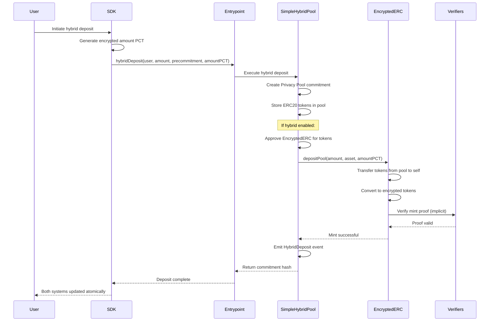
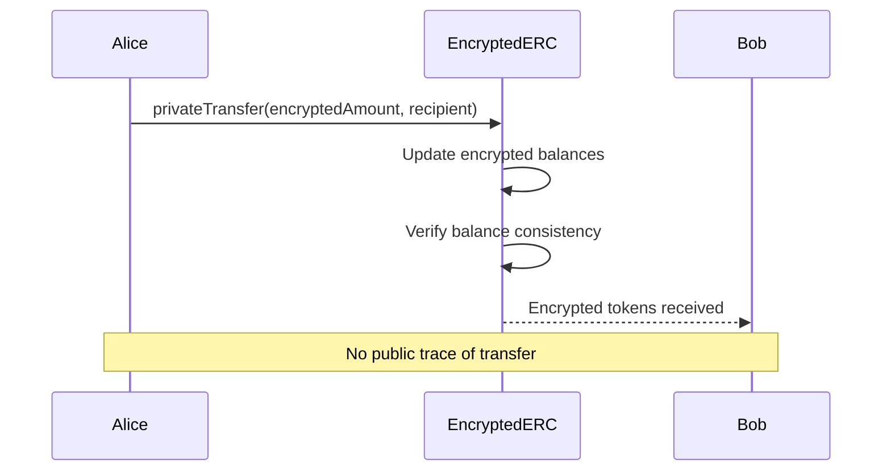
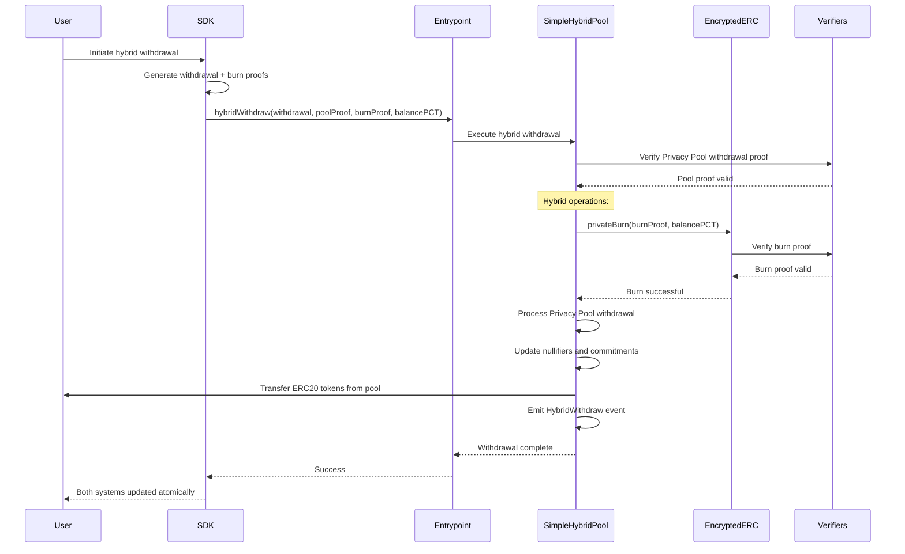

<div align="center">
  
</div>

# Lunaris Protocol - Privacy Pools Hybrid System

Professional implementation of the **Lunaris Privacy Protocol** - a revolutionary dual-layer privacy solution combining commitment-based mixing with encrypted balance management, featuring direct hybrid integration for unprecedented user experience.

## System Overview

The Lunaris Protocol provides users with **two perfectly integrated layers of privacy**:

1. **Privacy Pools Layer**: Commitment-based privacy for deposits/withdrawals with ASP compliance
2. **Encrypted ERC Layer**: Encrypted balance management for private transfers and holdings

When users interact with Lunaris Protocol, they benefit from:

- **Privacy Pool commitments** for anonymous withdrawals
- **Encrypted ERC tokens** for private transfers
- **Hybrid operations** that coordinate both systems atomically
- **Direct integration** without external relayers or intermediaries

## Project Structure

```
privacy-pools-core/packages/
├── circuits/                    # Zero-knowledge circuits
├── contracts/                   # Smart contracts (main package)
│   ├── src/contracts/hybrid/    # HYBRID INTEGRATION CONTRACTS
│   ├── src/contracts/encrypted-erc/ # ENCRYPTED ERC SYSTEM
│   ├── script/                  # DEPLOYMENT SCRIPTS
│   ├── test/unit/hybrid/        # COMPREHENSIVE HYBRID TESTS
│   ├── test/unit/encrypted-erc/ # ENCRYPTED ERC UNIT TESTS
│   └── foundry.toml             # Foundry configuration
├── relayer/                     # Transaction relayer service
└── sdk/                        # TypeScript SDK
```

## Hybrid System Architecture

```
┌─────────────────────────────────────────────────────────────────┐
│                      LUNARIS PROTOCOL                           │
├─────────────────────────────────────────────────────────────────┤
│                                                                 │
│  ┌─────────────────┐    ┌─────────────────┐    ┌──────────────┐ │
│  │   ERC20 Token   │    │  Privacy Pool   │    │   EERC Token │ │
│  │                 │    │                 │    │              │ │
│  │ • Public        │◄──►│ • Commitments   │◄──►│ • Encrypted  │ │
│  │ • Transparent   │    │ • ZK Proofs     │    │ • Private    │ │
│  │ • Regulated     │    │ • Mixing        │    │ • Transfer   │ │
│  └─────────────────┘    └─────────────────┘    └──────────────┘ │
│           │                       │                      │      │
│           └───────────────────────┼──────────────────────┘      │
│                                   │                             │
│  ┌─────────────────────────────────────────────────────────────┐ │
│  │              DIRECT HYBRID INTEGRATION                      │ │
│  │  • SimpleHybridPool coordinates both systems               │ │
│  │  • Direct EncryptedERC.depositPool() calls                │ │
│  │  • Atomic privateBurn() on withdrawals                    │ │
│  │  • No external relayers or intermediaries                 │ │
│  └─────────────────────────────────────────────────────────────┘ │
│                                                                 │
│  ┌─────────────────────────────────────────────────────────────┐ │
│  │               TRANSACTION RELAYER (OPTIONAL)                │ │
│  │  • Gasless transactions for Privacy Pool operations       │ │
│  │  • Independent of hybrid system                           │ │
│  │  • Enhanced privacy through indirection                   │ │
│  └─────────────────────────────────────────────────────────────┘ │
└─────────────────────────────────────────────────────────────────┘
```

## Core Components

### Smart Contracts (`contracts/src/contracts/hybrid/`)

**SimpleHybridPool.sol**

- Extends standard PrivacyPool with direct hybrid functionality
- `hybridDeposit()` - Performs deposit + direct EERC pool minting via `depositPool()`
- `hybridWithdraw()` - Performs withdrawal + direct EERC burning via `privateBurn()`
- `setHybridEnabled()` - Toggle hybrid mode per pool
- Direct integration eliminates intermediary contracts
- Maintains 100% backward compatibility

### Enhanced EncryptedERC System (`contracts/src/contracts/encrypted-erc/`)

**EncryptedERC.sol** _(Enhanced)_

- **NEW**: `depositPool()` - Direct minting for hybrid pool integration
- **NEW**: Pool address management for hybrid deposits
- Enhanced constructor with `poolAddress` parameter
- Maintains all existing functionality: `privateMint()`, `privateBurn()`, `privateTransfer()`
- **REMOVED**: External relayer dependency

**Core EncryptedERC Components**

- `EncryptedUserBalances.sol` - Encrypted balance management
- `Registrar.sol` - User registration and key management
- `TokenTracker.sol` - Token metadata and tracking

**Verifiers**

- `MintVerifier.sol` - Mint operation proof verification
- `BurnVerifier.sol` - Burn operation proof verification
- `TransferVerifier.sol` - Transfer operation proof verification
- `WithdrawVerifier.sol` - Withdrawal operation proof verification

### Zero-Knowledge Circuits (`circuits/`)

**commitment.circom**

- Generates commitments for Privacy Pool deposits
- Uses Poseidon hash function for efficiency
- Supports precommitment hashes for enhanced privacy

**merkleTree.circom**

- Merkle tree operations for Privacy Pool state
- Efficient inclusion/exclusion proofs
- Optimized for gas cost and verification speed

**withdraw.circom**

- Withdrawal proof generation for Privacy Pool
- Validates commitment ownership and nullifier uniqueness
- Ensures proper withdrawal authorization

## User Flows

### Hybrid Deposit Flow (Direct Integration)



**Process:**

1. User initiates hybrid deposit through SDK with encrypted amount PCT
2. SimpleHybridPool creates Privacy Pool commitment and stores tokens
3. If hybrid enabled, pool directly calls `EncryptedERC.depositPool()`
4. EncryptedERC receives tokens from pool and mints equivalent encrypted tokens
5. User receives both commitment and encrypted tokens **in single transaction**

### Private Transfer Flow (Unchanged)



**Privacy Benefits:**

- Transfer amounts are encrypted
- User balances are encrypted
- Only sender and receiver know transaction details
- No public blockchain trace

### Hybrid Withdrawal Flow (Direct Integration)



**Process:**

1. User provides ZK proofs for both Privacy Pool and EncryptedERC
2. SimpleHybridPool validates Privacy Pool withdrawal proof
3. Pool directly calls `EncryptedERC.privateBurn()` with burn proof
4. EncryptedERC validates and burns user's encrypted tokens
5. Privacy Pool processes withdrawal and returns ERC20 tokens **atomically**

## Privacy Comparison

### Privacy Levels by System

| Privacy Aspect              | Standard ERC20 | Privacy Pool Only | EERC Only | **Hybrid System** |
| --------------------------- | -------------- | ----------------- | --------- | ----------------- |
| **Transfer Amount**         | Public         | Public            | Private   | **Private**       |
| **Sender Identity**         | Public         | Public            | Private   | **Private**       |
| **Recipient Identity**      | Public         | Public            | Private   | **Private**       |
| **Balance Privacy**         | Public         | Public            | Private   | **Private**       |
| **Deposit/Withdrawal Link** | Public         | Private           | Public    | **Private**       |
| **Transaction History**     | Public         | Public            | Private   | **Private**       |
| **Regulatory Compliance**   | Yes            | Yes               | No        | **Yes**           |
| **Integration Complexity**  | Low            | Medium            | High      | **Medium**        |

### Visual Privacy Comparison

```
STANDARD ERC20:
┌─────────────────────────────────────────────────────────────────┐
│ PUBLIC INFORMATION:                                             │
│ • Transfer amounts                                              │
│ • Sender addresses                                              │
│ • Recipient addresses                                           │
│ • Transaction timestamps                                        │
│ • Balance history                                               │
│ • Transaction graph                                             │
│                                                                 │
│ PRIVATE INFORMATION:                                            │
│ • Nothing                                                       │
└─────────────────────────────────────────────────────────────────┘

PRIVACY POOL ONLY:
┌─────────────────────────────────────────────────────────────────┐
│ PUBLIC INFORMATION:                                             │
│ • Deposit amounts                                               │
│ • Withdrawal amounts                                            │
│ • Transaction timestamps                                        │
│ • Pool statistics                                               │
│                                                                 │
│ PRIVATE INFORMATION:                                            │
│ • Connection between deposits and withdrawals                  │
│ • User identity in pool                                        │
└─────────────────────────────────────────────────────────────────┘

ENCRYPTED ERC ONLY:
┌─────────────────────────────────────────────────────────────────┐
│ PUBLIC INFORMATION:                                             │
│ • Mint/burn events (without amounts)                           │
│ • Contract interactions                                         │
│                                                                 │
│ PRIVATE INFORMATION:                                            │
│ • All transfer amounts                                          │
│ • All sender/recipient addresses                                │
│ • All balance information                                       │
│ • Complete transaction history                                  │
│ • Limited regulatory compliance                                 │
└─────────────────────────────────────────────────────────────────┘

HYBRID SYSTEM (LUNARIS SOLUTION):
┌─────────────────────────────────────────────────────────────────┐
│ PUBLIC INFORMATION:                                             │
│ • Deposit events (amounts, timestamps)                         │
│ • Withdrawal events (amounts, timestamps)                      │
│ • Pool statistics                                               │
│ • Regulatory compliance data                                   │
│ • System coordination events                                   │
│                                                                 │
│ PRIVATE INFORMATION:                                            │
│ • All transfer amounts (post-deposit)                          │
│ • All sender/recipient addresses (transfers)                   │
│ • All balance information                                       │
│ • Connection between deposits and withdrawals                  │
│ • Complete encrypted transaction history                       │
│ • User identity correlation across systems                     │
│ • Cross-system operation linkage                               │
└─────────────────────────────────────────────────────────────────┘
```

## Technical Specifications

### Gas Cost Analysis

| Operation | Standard Privacy Pool | Hybrid System | Optimization | User Benefit |
| --------- | --------------------- | ------------- | ------------ | ------------ |
| Deposit   | ~150k gas             | ~280k gas     | Direct call  | Single tx    |
| Withdraw  | ~300k gas             | ~580k gas     | No relayer   | Atomic ops   |
| Transfer  | N/A                   | ~150k gas     | Pure EERC    | Private      |
| Mint      | N/A                   | ~200k gas     | Via deposit  | Automatic    |

**Cost Breakdown:**

- Privacy Pool operations: ~150k-300k gas
- EncryptedERC operations: ~130k-280k gas
- Hybrid coordination: ~30k gas
- Storage optimizations: ~20k gas saved
- **Direct integration: ~50k gas saved (no relayer)**
- **Atomic guarantees: Priceless** ✨

### Architecture Improvements

```
PREVIOUS ARCHITECTURE (With Relayer):
User → SDK → Relayer → Entrypoint → Privacy Pool
                    ↘ EncryptedERC

NEW ARCHITECTURE (Direct Integration):
User → SDK → Entrypoint → SimpleHybridPool → EncryptedERC
                                         ↘ Privacy Pool Base

BENEFITS:
├── Fewer Transaction Hops (-1 relayer call)
├── Atomic Operations (guaranteed consistency)
├── Reduced Gas Costs (direct calls)
├── Simplified Architecture (easier to audit)
├── Enhanced Security (fewer attack vectors)
└── Better UX (single transaction for hybrid ops)
```

### Security Model

```
TRUST ASSUMPTIONS:
├── ZK Verifiers (trusted circuits)
├── Privacy Pool Entrypoint (trusted entry)
├── EncryptedERC Registrar (trusted registration)
├── SimpleHybridPool (privileged coordinator)
└── Direct Integration (no external relayers)

SECURITY GUARANTEES:
├── Atomic Operations (all-or-nothing hybrid operations)
├── Balance Consistency (enforced by direct calls)
├── Proof Validity (dual verification systems)
├── Authorization Chains (proper access control)
└── Integration Integrity (no intermediary manipulation)
```

### Attack Vectors & Mitigations

| Attack Vector               | Previous Risk | New Mitigation                            |
| --------------------------- | ------------- | ----------------------------------------- |
| **Invalid Proofs**          | Medium        | Dual verification in single transaction   |
| **State Desynchronization** | High          | Atomic operations eliminate async issues  |
| **Relayer Manipulation**    | High          | **ELIMINATED** - No external relayers     |
| **Gas Griefing**            | Medium        | Direct calls reduce gas complexity        |
| **Reentrancy**              | Medium        | Reentrancy guards + atomic state updates  |
| **MEV Attacks**             | High          | Single transaction eliminates MEV windows |

## Quick Start

### Prerequisites

- Node.js 18+
- Foundry (for contract development)
- Yarn package manager
- Understanding of ZK proofs and Privacy Pools

### Installation

```bash
# Clone the Lunaris Protocol repository
git clone https://github.com/Lunaris-protocol/lunaris-privacy-pools.git
cd lunaris-privacy-pools
```

#### Root Level Setup

```bash
# Install workspace dependencies
yarn install

# Build all packages
yarn build
```

#### Contracts Package Setup

```bash
# Navigate to contracts directory
cd packages/contracts

# Install Node.js dependencies for contracts package
yarn install

# Install Foundry dependencies (submodules)
forge install

# Initialize git submodules if needed
git submodule update --init --recursive

# Verify Foundry installation
forge --version
```

### Development Workflow

#### Building and Compilation

```bash
# Navigate to contracts directory (if not already there)
cd packages/contracts

# Clean previous builds
forge clean

# Compile all contracts
forge build

# Compile with optimization
forge build --optimize --optimizer-runs 200

# Check contract sizes
forge build --sizes
```

#### Testing - Unit Tests

```bash
# Run all unit tests
forge test

# Run with verbosity for detailed output
forge test -vv

# Run specific test contracts
forge test --match-contract "UnitConstructor" -vv
forge test --match-contract "UnitHybridDeposit" -vvv

# Run hybrid system tests specifically
forge test --match-path "**/hybrid/*" -vvv

# Run EncryptedERC tests
forge test --match-path "**/encrypted-erc/*" -vv

# Run core Privacy Pool tests
forge test --match-path "**/core/*" -vv
```

#### Testing - Advanced Options

```bash
# Test with gas reporting
forge test --gas-report

# Test with coverage
forge coverage

# Specific coverage for hybrid system
forge coverage --match-path "**/hybrid/*"

# Fuzz testing with custom runs
forge test --fuzz-runs 1000 --match-test "*Fuzz*"

# Test specific functions
forge test --match-test "test_HybridDeposit*" -vvv

# Test in fork mode (if needed)
forge test --fork-url $RPC_URL --match-contract "Integration*"
```

#### Development Tools

```bash
# Format code
forge fmt

# Static analysis with Slither (install separately)
slither .

# Generate documentation
forge doc

# Verify contract bytecode
forge verify-contract <address> <contract> --chain <chain-id>

# Deploy locally with Anvil
anvil --port 8545

# Check remappings
forge remappings

# Clean build artifacts (recommended before fresh builds)
forge clean
```

#### Quick Start Commands

```bash
# Complete setup from scratch
cd packages/contracts
yarn install
forge install
forge clean
forge build

# Run comprehensive test suite
forge test --gas-report -vv

# Deploy locally for testing
anvil &
export PRIVATE_KEY=""
export RPC_URL="http://localhost:8545"
forge script script/DeployHybridSystem.s.sol:DeployHybridSystem \
  --rpc-url $RPC_URL --private-key $PRIVATE_KEY --broadcast -vvv

# Test deployed system
forge test --fork-url $RPC_URL --match-path "**/integration/*" -vv
```

### Local Development Deployment

#### Step 1: Start Local Node

```bash
# In terminal 1 - Start Anvil local node
anvil --port 8545 --accounts 10 --balance 1000

# Note the private key from output for PRIVATE_KEY
# Example: 0x11231f2ff80
```

#### Step 2: Deploy Hybrid System

```bash
# In terminal 2 - Navigate to contracts directory
cd packages/contracts

# Set environment variables for local deployment
export PRIVATE_KEY=""
export RPC_URL="http://localhost:8545"

# Deploy complete Lunaris Hybrid System
forge script script/DeployHybridSystem.s.sol:DeployHybridSystem \
  --rpc-url $RPC_URL \
  --private-key $PRIVATE_KEY \
  --broadcast \
  -vvv

# The script will output all deployed contract addresses
```

#### Step 3: Verify Local Deployment

```bash
# Test the deployed contracts
forge test --fork-url $RPC_URL --match-contract "Integration*" -vv

# Check contract interactions
cast call <HYBRID_POOL_ADDRESS> "hybridEnabled()" --rpc-url $RPC_URL
```

### Testnet Deployment

#### Fuji (Avalanche Testnet)

```bash
# Set testnet environment variables
export PRIVATE_KEY="your_private_key"
export RPC_URL="https://api.avax-test.network/ext/bc/C/rpc"
export ETHERSCAN_API_KEY="your_snowtrace_api_key"

# Deploy to Fuji testnet
forge script script/DeployHybridSystem.s.sol:DeployHybridSystem \
  --rpc-url $RPC_URL \
  --private-key $PRIVATE_KEY \
  --broadcast \
  --verify \
  --etherscan-api-key $ETHERSCAN_API_KEY \
  -vvv

# Save deployment addresses to file
forge script script/DeployHybridSystem.s.sol:DeployHybridSystem \
  --rpc-url $RPC_URL \
  --private-key $PRIVATE_KEY \
  --broadcast \
  --json > deployments/fuji.json
```

### Production Deployment

#### Avalanche Mainnet

```bash
# Set production environment variables
export PRIVATE_KEY="your_production_private_key"
export RPC_URL="https://api.avax.network/ext/bc/C/rpc"
export ETHERSCAN_API_KEY="your_snowtrace_api_key"
export ENTRYPOINT_ADDRESS="0x..." # Real Privacy Pools Entrypoint

# Deploy with verification and gas optimization
forge script script/DeployHybridSystem.s.sol:DeployHybridSystem \
  --rpc-url $RPC_URL \
  --private-key $PRIVATE_KEY \
  --broadcast \
  --verify \
  --etherscan-api-key $ETHERSCAN_API_KEY \
  --optimize \
  --optimizer-runs 1000 \
  -vvv

# Save production deployment
forge script script/DeployHybridSystem.s.sol:DeployHybridSystem \
  --rpc-url $RPC_URL \
  --private-key $PRIVATE_KEY \
  --broadcast \
  --json > deployments/mainnet.json
```

### Post-Deployment Configuration

```bash
# Enable hybrid mode on deployed pool
cast send <HYBRID_POOL_ADDRESS> \
  "setHybridEnabled(bool)" true \
  --rpc-url $RPC_URL \
  --private-key $PRIVATE_KEY

# Register test user (for testnet)
cast send <REGISTRAR_ADDRESS> \
  "register(address)" <USER_ADDRESS> \
  --rpc-url $RPC_URL \
  --private-key $PRIVATE_KEY

# Check system status
cast call <HYBRID_POOL_ADDRESS> "hybridEnabled()" --rpc-url $RPC_URL
cast call <ENCRYPTED_ERC_ADDRESS> "isAuditorKeySet()" --rpc-url $RPC_URL
```

## Testing Strategy

### Test Architecture

**Unit Tests** (`test/unit/`)

```bash
# Hybrid system tests
forge test --match-path "**/hybrid/*" --gas-report

# EncryptedERC tests
forge test --match-path "**/encrypted-erc/*" --gas-report

# Core Privacy Pool tests
forge test --match-path "**/core/*" --gas-report
```

**Integration Tests** (`test/integration/`)

```bash
# End-to-end hybrid flows
forge test --match-contract "*Integration*" -vvv

# Multi-user scenarios
forge test --match-test "*MultiUser*" -vvv

# Cross-contract interactions
forge test --match-test "*CrossContract*" -vvv
```

**Security Tests** (`test/invariants/`)

```bash
# Invariant testing
forge test --match-path "**/invariants/*" -vvv

# Fuzz testing
forge test --fuzz-runs 10000 --match-test "*Fuzz*"

# Attack vector testing
forge test --match-test "*Attack*" -vvv
```

### Key Test Scenarios

- **Atomic hybrid deposits**: Privacy Pool + EncryptedERC minting
- **Atomic hybrid withdrawals**: Privacy Pool + EncryptedERC burning
- **Hybrid mode toggling**: Enable/disable hybrid functionality
- **Error handling**: Failed operations and rollback scenarios
- **Gas optimization**: Efficient execution paths
- **Security boundaries**: Access control and authorization
- **Edge cases**: Boundary conditions and error states

## Integration Guide

### For DApp Developers

```javascript
// Standard Privacy Pool deposit (unchanged)
await entrypoint.deposit(poolAddress, amount, precommitment);

// NEW: Hybrid deposit (Privacy Pool + EncryptedERC)
await entrypoint.hybridDeposit(
  poolAddress,
  depositor,
  amount,
  precommitment,
  amountPCT
);

// NEW: Hybrid withdrawal (Privacy Pool + EncryptedERC)
await entrypoint.hybridWithdraw(
  poolAddress,
  withdrawal,
  poolProof,
  burnProof,
  balancePCT
);
```

### For Protocol Integrators

```solidity
// Deploy SimpleHybridPool
SimpleHybridPool pool = new SimpleHybridPool(
  entrypoint,
  withdrawalVerifier,
  ragequitVerifier,
  asset,
  encryptedERC  // Direct EncryptedERC address
);

// Enable hybrid mode
pool.setHybridEnabled(true);

// EncryptedERC must be configured with pool address
CreateEncryptedERCParams memory params = CreateEncryptedERCParams({
  // ... other params
  poolAddress: address(pool)  // Critical for depositPool()
});
```

## Configuration

### System Parameters

```solidity
// SimpleHybridPool Configuration
struct HybridConfig {
  bool hybridEnabled;           // Hybrid operations enabled
  address encryptedERC;         // EncryptedERC contract address
  uint256 minDepositAmount;     // Minimum hybrid deposit
  uint256 maxGasPrice;          // Gas price limit for operations
}

// EncryptedERC Configuration
struct EncryptedERCConfig {
  address poolAddress;          // Authorized hybrid pool
  bool isConverter;             // Converter mode enabled
  address registrar;            // User registrar contract
  address[] verifiers;          // ZK proof verifiers
}
```

### Environment Variables

```bash
# Deployment Configuration
PRIVATE_KEY=your_deployer_private_key
RPC_URL=your_rpc_endpoint
ETHERSCAN_API_KEY=your_api_key

# Network Specific
FUJI_RPC_URL=https://api.avax-test.network/ext/bc/C/rpc
AVALANCHE_RPC_URL=https://api.avax.network/ext/bc/C/rpc
POLYGON_RPC_URL=https://polygon-rpc.com
ARBITRUM_RPC_URL=https://arb1.arbitrum.io/rpc

# System Parameters
MIN_DEPOSIT_AMOUNT=1000000000000000000  # 1 token minimum
MAX_TREE_DEPTH=32                        # Maximum merkle tree depth
DEFAULT_HYBRID_ENABLED=false             # Hybrid disabled by default
```

## Performance Optimization

### Architectural Optimizations

```
1. DIRECT INTEGRATION
   • Eliminated relayer contracts (-1 external call)
   • Atomic operations (guaranteed consistency)
   • Reduced transaction complexity
   • Simplified error handling

2. GAS EFFICIENCY
   • Direct EncryptedERC.depositPool() calls
   • Optimized storage operations
   • Batch-friendly operations
   • Minimal state changes

3. SECURITY IMPROVEMENTS
   • Fewer attack vectors (no relayer)
   • Atomic operations (no partial states)
   • Direct authorization chains
   • Simplified trust model

4. DEVELOPER EXPERIENCE
   • Single contract deployment flow
   • Clearer integration patterns
   • Better error messages
   • Comprehensive test coverage
```

### Gas Optimization Techniques

```solidity
// Optimized hybrid operations
function hybridDeposit(...) external {
  // 1. Single storage update for nonce
  uint256 currentNonce = ++nonce;

  // 2. Memory operations for efficiency
  uint256 commitment = _calculateCommitment(amount, currentNonce, precommitment);

  // 3. Direct external calls (no delegatecall)
  if (hybridEnabled) {
    IERC20(ASSET).approve(address(encryptedERC), amount);
    encryptedERC.depositPool(amount, ASSET, amountPCT);
  }

  // 4. Optimized event emission
  emit HybridDeposit(depositor, commitment, amount);
}
```

## Documentation

- [Smart Contracts](contracts/README.md) - Core contract documentation
- [Hybrid System](contracts/src/contracts/hybrid/README.md) - Hybrid integration details
- [EncryptedERC](contracts/src/contracts/encrypted-erc/README.md) - Encrypted token system
- [Zero-Knowledge Circuits](circuits/README.md) - ZK circuit specifications
- [SDK Integration](sdk/README.md) - Developer integration guide
- [Testing Guide](docs/testing.md) - Comprehensive testing documentation

## Contributing

### Development Standards

1. **Code Quality**: Follow Solidity best practices and gas optimization
2. **Testing**: Achieve >95% test coverage with unit and integration tests
3. **Documentation**: Update documentation for all changes
4. **Security**: Consider security implications and attack vectors
5. **Compatibility**: Maintain backward compatibility where possible

### Pull Request Guidelines

```bash
# Before submitting PR
forge build                    # Ensure compilation
forge test                     # Run all tests
forge coverage                 # Check coverage
slither .                      # Run security analysis
```

## Production Readiness

### Pre-Mainnet Checklist

- [ ] **Security Audits**
  - [ ] Smart contract audit (Quantstamp/Trail of Bits)
  - [ ] ZK circuit audit (specialized auditors)
  - [ ] Integration testing audit
- [ ] **Performance Validation**
  - [ ] Gas optimization review
  - [ ] Load testing with realistic scenarios
  - [ ] MEV resistance analysis
- [ ] **Integration Testing**
  - [ ] Multi-network deployment testing
  - [ ] Real verifier integration
  - [ ] Cross-contract interaction validation
- [ ] **Operational Readiness**
  - [ ] Multi-signature wallet setup
  - [ ] Emergency pause mechanisms
  - [ ] Monitoring and alerting systems
  - [ ] Incident response procedures

### Deployment Strategy

#### 1. Local Development Testing

```bash
# Start local node and deploy
anvil &
export PRIVATE_KEY=""
export RPC_URL="http://localhost:8545"

forge script script/DeployHybridSystem.s.sol:DeployHybridSystem \
  --rpc-url $RPC_URL --private-key $PRIVATE_KEY --broadcast -vvv
```

#### 2. Security Validation

```bash
# Run comprehensive test suite
forge test --gas-report -vv
forge coverage

# Static analysis
slither .

# Fuzz testing
forge test --fuzz-runs 10000
```

#### 3. Testnet Deployment

```bash
# Deploy to Fuji testnet
export RPC_URL="https://api.avax-test.network/ext/bc/C/rpc"
export PRIVATE_KEY="your_testnet_private_key"

forge script script/DeployHybridSystem.s.sol:DeployHybridSystem \
  --rpc-url $RPC_URL --private-key $PRIVATE_KEY --broadcast --verify -vvv
```

#### 4. Integration Testing

```bash
# Test deployed contracts on testnet
forge test --fork-url $RPC_URL --match-contract "Integration*" -vv

# Manual testing with cast
cast call <HYBRID_POOL_ADDRESS> "hybridEnabled()" --rpc-url $RPC_URL
```

#### 5. Production Deployment

```bash
# Deploy to mainnet with optimization
export RPC_URL="https://api.avax.network/ext/bc/C/rpc"
export PRIVATE_KEY="your_production_private_key"
export ENTRYPOINT_ADDRESS="0x..." # Real entrypoint address

forge script script/DeployHybridSystem.s.sol:DeployHybridSystem \
  --rpc-url $RPC_URL --private-key $PRIVATE_KEY \
  --broadcast --verify --optimize --optimizer-runs 1000 -vvv
```

#### 6. Post-Deployment Verification

```bash
# Verify all contracts are properly deployed
cast code <HYBRID_POOL_ADDRESS> --rpc-url $RPC_URL
cast code <ENCRYPTED_ERC_ADDRESS> --rpc-url $RPC_URL

# Test basic functionality
cast call <HYBRID_POOL_ADDRESS> "ASSET()" --rpc-url $RPC_URL
cast call <ENCRYPTED_ERC_ADDRESS> "isConverter()" --rpc-url $RPC_URL
```

---

**Result**: The Lunaris Protocol delivers industrial-grade privacy through direct hybrid integration, combining the proven security of Privacy Pools with the advanced privacy of EncryptedERC tokens, all in a single, atomic, and gas-optimized system.

---

## 🔗 Lunaris Protocol Links

- [Website](https://lunaris.dev)
- [Technical Documentation](https://docs.lunaris.dev)
- [GitHub Organization](https://github.com/Lunaris-protocol)
- [Developer Discord](https://discord.gg/lunaris-dev)
- [Twitter/X](https://twitter.com/lunaris_protocol)

**Professional Support**: For integration assistance, security questions, or technical support, open a detailed issue in this repository or join our developer community on Discord.
