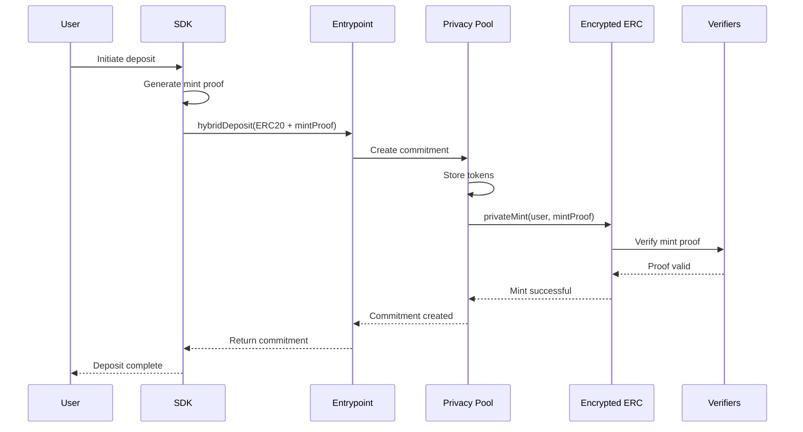
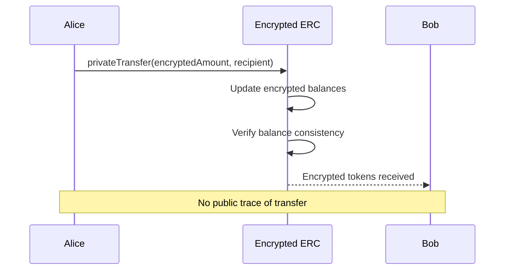
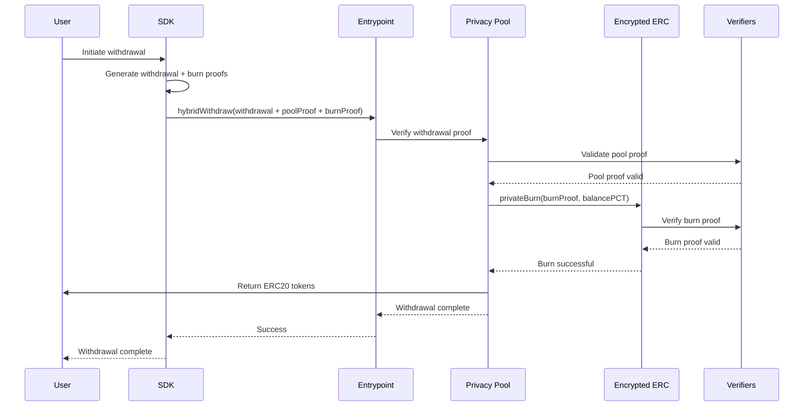

<div align="center">
  
</div>

# Privacy Pools Core - Hybrid System

Professional implementation of the **Privacy Pools + Encrypted ERC Hybrid System** - a dual-layer privacy solution combining commitment-based mixing with encrypted balance management.

## System Overview

The Hybrid System provides users with **two complementary layers of privacy**:

1. **Privacy Pools Layer**: Commitment-based privacy for deposits/withdrawals with ASP compliance
2. **Encrypted ERC Layer**: Encrypted balance management for private transfers and holdings

When users deposit ERC20 tokens, they simultaneously get:

- A commitment in the Privacy Pool (for private withdrawals)
- Encrypted ERC tokens (for private transfers)

## Project Structure

```
privacy-pools-core/packages/
├── circuits/                    # Zero-knowledge circuits
├── contracts/                   # Smart contracts (main package)
│   ├── src/contracts/hybrid/    # HYBRID CONTRACTS
│   ├── script/hybrid/           # DEPLOYMENT SCRIPTS
│   ├── test/hybrid/             # COMPREHENSIVE TESTS
│   └── foundry.toml             # Foundry configuration
├── encrypted-erc/               # ENCRYPTED ERC CONTRACTS
├── relayer/                     # Transaction relayer service
└── sdk/                        # TypeScript SDK
```

## Hybrid System Architecture

```
┌─────────────────────────────────────────────────────────────────┐
│                    PRIVACY POOL PROTOCOL                        │
├─────────────────────────────────────────────────────────────────┤
│                                                                 │
│  ┌─────────────────┐    ┌─────────────────┐    ┌──────────────┐ │
│  │   ERC20 Token   │    │  Privacy Pool   │    │   EERC Token │ │
│  │                 │    │                 │    │              │ │
│  │ • Public        │◄──►│ • Commitments   │◄──►│ • Encrypted  │ │
│  │ • Transparent   │    │ • ZK Proofs     │    │ • Private    │ │
│  │ • Regulated     │    │ • Mixing        │    │ • Transfer   │ │
│  └─────────────────┘    └─────────────────┘    └──────────────┘ │
│           │                       │                      │      │
│           └───────────────────────┼──────────────────────┘      │
│                                   │                             │
│  ┌─────────────────────────────────────────────────────────────┐ │
│  │              HYBRID ORCHESTRATOR                            │ │
│  │  • Coordinates both systems                                 │ │
│  │  • Ensures balance consistency                              │ │
│  │  • Manages atomic operations                               │ │
│  └─────────────────────────────────────────────────────────────┘ │
└─────────────────────────────────────────────────────────────────┘
```

## Core Components

### Smart Contracts (`contracts/src/contracts/hybrid/`)

**SimpleHybridPool.sol**

- Extends standard PrivacyPool with hybrid functionality
- `hybridDeposit()` - Performs deposit + automatic EERC minting
- `hybridWithdraw()` - Performs withdrawal + automatic EERC burning
- `setHybridEnabled()` - Toggle hybrid mode per pool
- Maintains 100% backward compatibility

**HybridPoolController.sol**

- Advanced orchestrator for complex hybrid operations
- Multi-asset support and batch operations
- Enhanced security and monitoring capabilities

### Zero-Knowledge Circuits (`circuits/`)

**commitment.circom**

- Generates commitments for Privacy Pool deposits
- Uses Poseidon hash function for efficiency
- Supports precommitment hashes for enhanced privacy

**merkleTree.circom**

- Merkle tree operations for Privacy Pool state
- Efficient inclusion/exclusion proofs
- Optimized for gas cost and verification speed

**withdraw.circom**

- Withdrawal proof generation for Privacy Pool
- Validates commitment ownership and nullifier uniqueness
- Ensures proper withdrawal authorization

### Encrypted ERC System (`encrypted-erc/`)

**Core Contracts**

- `EncryptedERC.sol` - Main encrypted token contract
- `EncryptedUserBalances.sol` - Encrypted balance management
- `Registrar.sol` - User registration and key management

**Verifiers**

- `MintVerifier.sol` - Mint operation proof verification
- `BurnVerifier.sol` - Burn operation proof verification
- `TransferVerifier.sol` - Transfer operation proof verification

## User Flows

### Deposit Flow



**Process:**

1. User deposits ERC20 tokens with mint proof
2. Privacy Pool creates commitment and stores tokens
3. EncryptedERC automatically mints equivalent tokens
4. User receives both commitment and encrypted tokens

### Private Transfer Flow



**Privacy Benefits:**

- Transfer amounts are encrypted
- User balances are encrypted
- Only sender and receiver know transaction details
- No public blockchain trace

### Withdrawal Flow



**Process:**

1. User provides ZK proofs for both Privacy Pool and EERC
2. Privacy Pool validates withdrawal proof
3. EncryptedERC burns tokens using burn proof
4. Privacy Pool processes withdrawal and returns ERC20 tokens

## Privacy Comparison

### Privacy Levels by System

| Privacy Aspect              | Standard ERC20 | Privacy Pool Only | EERC Only | **Hybrid System** |
| --------------------------- | -------------- | ----------------- | --------- | ----------------- |
| **Transfer Amount**         | Public         | Public            | Private   | **Private**       |
| **Sender Identity**         | Public         | Public            | Private   | **Private**       |
| **Recipient Identity**      | Public         | Public            | Private   | **Private**       |
| **Balance Privacy**         | Public         | Public            | Private   | **Private**       |
| **Deposit/Withdrawal Link** | Public         | Private           | Public    | **Private**       |
| **Transaction History**     | Public         | Public            | Private   | **Private**       |
| **Regulatory Compliance**   | Yes            | Yes               | No        | **Yes**           |

### Visual Privacy Comparison

```
STANDARD ERC20:
┌─────────────────────────────────────────────────────────────────┐
│ PUBLIC INFORMATION:                                             │
│ • Transfer amounts                                              │
│ • Sender addresses                                              │
│ • Recipient addresses                                           │
│ • Transaction timestamps                                        │
│ • Balance history                                               │
│ • Transaction graph                                             │
│                                                                 │
│ PRIVATE INFORMATION:                                            │
│ • Nothing                                                       │
└─────────────────────────────────────────────────────────────────┘

PRIVACY POOL ONLY:
┌─────────────────────────────────────────────────────────────────┐
│ PUBLIC INFORMATION:                                             │
│ • Deposit amounts                                               │
│ • Withdrawal amounts                                            │
│ • Transaction timestamps                                        │
│ • Pool statistics                                               │
│                                                                 │
│ PRIVATE INFORMATION:                                            │
│ • Connection between deposits and withdrawals                  │
│ • User identity in pool                                        │
└─────────────────────────────────────────────────────────────────┘

ENCRYPTED ERC ONLY:
┌─────────────────────────────────────────────────────────────────┐
│ PUBLIC INFORMATION:                                             │
│ • Nothing                                                       │
│                                                                 │
│ PRIVATE INFORMATION:                                            │
│ • All transfer amounts                                          │
│ • All sender/recipient addresses                                │
│ • All balance information                                       │
│ • Complete transaction history                                  │
│ • No regulatory compliance                                      │
└─────────────────────────────────────────────────────────────────┘

HYBRID SYSTEM (OUR SOLUTION):
┌─────────────────────────────────────────────────────────────────┐
│ PUBLIC INFORMATION:                                             │
│ • Deposit events (amounts, timestamps)                         │
│ • Withdrawal events (amounts, timestamps)                      │
│ • Pool statistics                                               │
│ • Regulatory compliance data                                   │
│                                                                 │
│ PRIVATE INFORMATION:                                            │
│ • All transfer amounts                                          │
│ • All sender/recipient addresses                                │
│ • All balance information                                       │
│ • Connection between deposits and withdrawals                  │
│ • Complete transaction history                                  │
│ • User identity in both systems                                │
└─────────────────────────────────────────────────────────────────┘
```

## Technical Specifications

### Gas Cost Analysis

| Operation | Standard Privacy Pool | Hybrid System | Additional Cost |
| --------- | --------------------- | ------------- | --------------- |
| Deposit   | ~150k gas             | ~350k gas     | +200k (+133%)   |
| Withdraw  | ~300k gas             | ~700k gas     | +400k (+133%)   |
| Transfer  | N/A                   | ~150k gas     | New capability  |

**Cost Breakdown:**

- Privacy Pool operations: ~150k-300k gas
- EncryptedERC minting/burning: ~150k gas
- Additional coordination: ~50k gas
- Storage operations: ~50k gas

### Security Model

```
TRUST ASSUMPTIONS:
├── ZK Verifiers (trusted circuits)
├── Privacy Pool Entrypoint (trusted entry)
├── EncryptedERC Registrar (trusted registration)
└── Hybrid Pool Contract (privileged coordinator)

SECURITY GUARANTEES:
├── Balance Consistency (orchestrator ensures)
├── Atomic Operations (all-or-nothing)
├── Proof Validity (all ZK proofs verified)
└── Authorization (only approved operations)
```

### Attack Vectors & Mitigations

| Attack Vector               | Mitigation                                  |
| --------------------------- | ------------------------------------------- |
| **Invalid Proofs**          | Dual verification, circuit audits           |
| **State Desynchronization** | Atomic operations, comprehensive validation |
| **Gas Griefing**            | Gas limits, efficient implementations       |
| **Reentrancy**              | Reentrancy guards, proper state management  |

## Quick Start

### Prerequisites

- Node.js 18+
- Foundry (for contract development)
- Yarn package manager

### Installation

```bash
# Clone the repository
git clone https://github.com/your-org/privacy-pools-core.git
cd privacy-pools-core/packages

# Install dependencies
yarn install

# Build all packages
yarn build
```

### Development

```bash
# Navigate to contracts directory
cd contracts

# Compile contracts
forge build

# Run hybrid tests
forge test --match-contract HybridTest -vvv

# Test coverage
forge coverage --match-contract Hybrid
```

### Deployment

```bash
# Set environment variables
export PRIVATE_KEY="your_private_key"
export RPC_URL="https://api.avax-test.network/ext/bc/C/rpc"

# Deploy hybrid system
forge script script/hybrid/DeployWithConfig.s.sol:DeployWithConfig --broadcast --verify

# Check system status
forge script script/hybrid/Interact.s.sol:Interact --sig "checkStatus()"
```

## Testing Strategy

### Test Categories

**Unit Tests**

- Individual contract functionality
- Edge cases and error conditions
- Gas optimization verification

**Integration Tests**

- End-to-end system flows
- Cross-contract interactions
- Multi-user scenarios

**Security Tests**

- Attack vector coverage
- Reentrancy protection
- Access control validation

### Key Test Scenarios

- End-to-end deposit with encrypted minting
- End-to-end withdrawal with coordinated burning
- Multi-user scenarios with different assets
- Security edge cases and attack prevention
- Gas optimization verification
- Backward compatibility validation

## Configuration

### Required Contracts

- Privacy Pools Entrypoint
- Privacy Pool verifiers (withdrawal, ragequit)
- EncryptedERC components (registrar, verifiers)
- ERC20 tokens to support

### System Parameters

- Minimum deposit amounts per asset
- Fee structures (vetting fees, relay fees)
- Tree depth limits
- Gas limits

### Environment Variables

```bash
# Deployment
PRIVATE_KEY=your_deployer_private_key
RPC_URL=your_rpc_endpoint
ETHERSCAN_API_KEY=your_api_key

# Network specific
FUJI_RPC_URL=https://api.avax-test.network/ext/bc/C/rpc
AVALANCHE_RPC_URL=https://api.avax.network/ext/bc/C/rpc
```

## Performance Optimization

### Optimization Strategies

```
1. BATCH OPERATIONS
   • Multiple deposits in single transaction
   • Batch proof verification
   • Reduced gas overhead per operation

2. EFFICIENT PROOF GENERATION
   • Optimized circuit design
   • Parallel proof computation
   • Cached intermediate results

3. SMART CONTRACT OPTIMIZATIONS
   • Minimal storage operations
   • Efficient data structures
   • Gas-optimized algorithms

4. LAYER 2 INTEGRATION
   • Rollup-based scaling
   • Reduced on-chain gas costs
   • Faster transaction processing
```

## Integration Guide

### For DApp Developers

- Standard deposits work unchanged
- For hybrid withdrawals, use `withdrawWithBurn()` with both ZK proofs
- Query both systems for complete user state

### For Protocol Integrators

- Extend `SimpleHybridPool` and `EncryptedERC`
- Deploy and configure hybrid orchestrator
- Set up proper authorization chains

## Documentation

- [Contracts README](contracts/README.md) - Smart contracts documentation
- [Hybrid Contracts](contracts/src/contracts/hybrid/README.md) - Hybrid system specifics
- [Circuits](circuits/README.md) - Zero-knowledge circuits
- [SDK](sdk/README.md) - Developer SDK
- [Relayer](relayer/README.md) - Transaction relayer

## Contributing

1. Follow existing code standards and structure
2. Add comprehensive tests for new features
3. Update documentation
4. Ensure backward compatibility
5. Consider gas optimization

## Production Checklist

Before mainnet deployment:

- [ ] Complete security audit
- [ ] Gas optimization review
- [ ] Integration testing with real verifiers
- [ ] Multi-signature orchestrator setup
- [ ] Emergency procedures documented
- [ ] Monitoring and alerting configured

---

**Result**: Users get dual-layer privacy combining the best of both privacy pool mixing and encrypted balance management in a single, seamless system.

**Contact**: For questions or support, open an issue in this repository.
