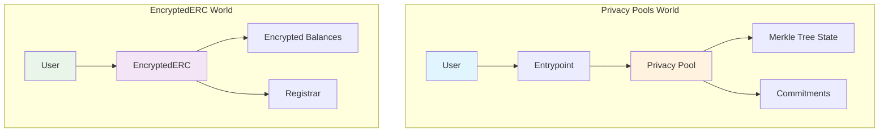
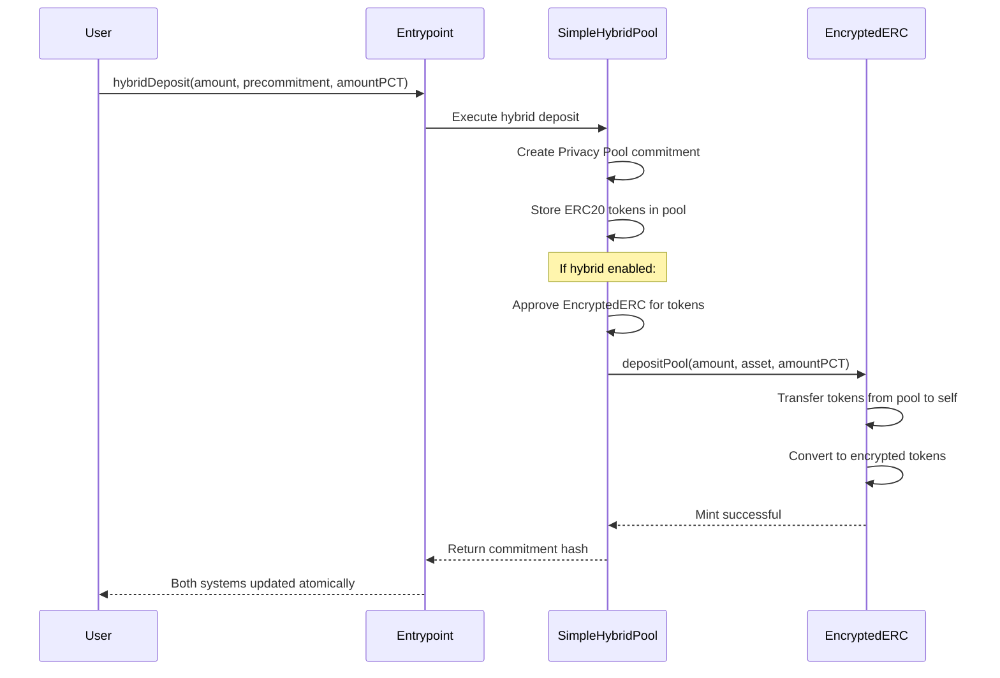
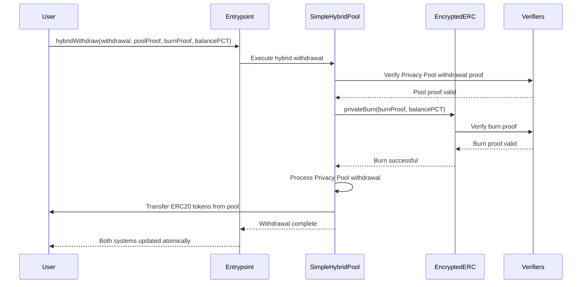
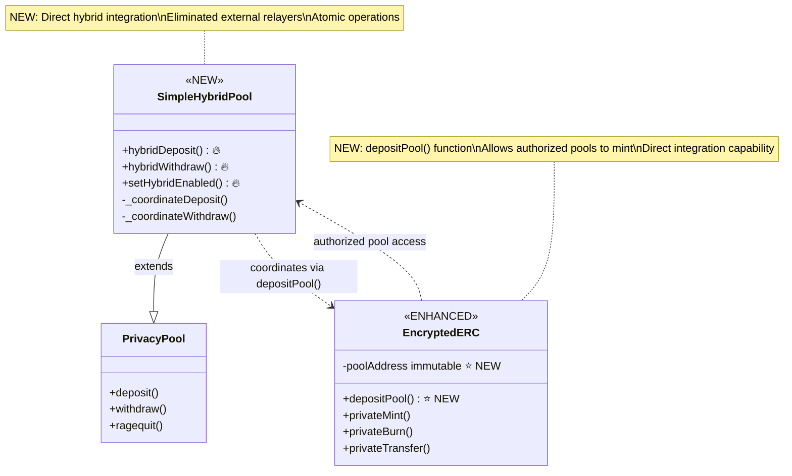
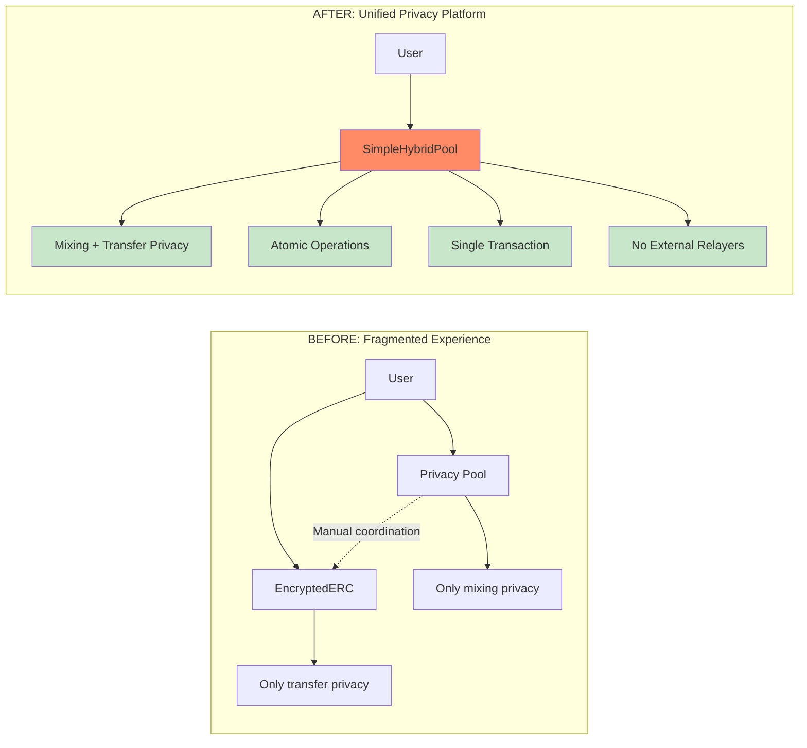
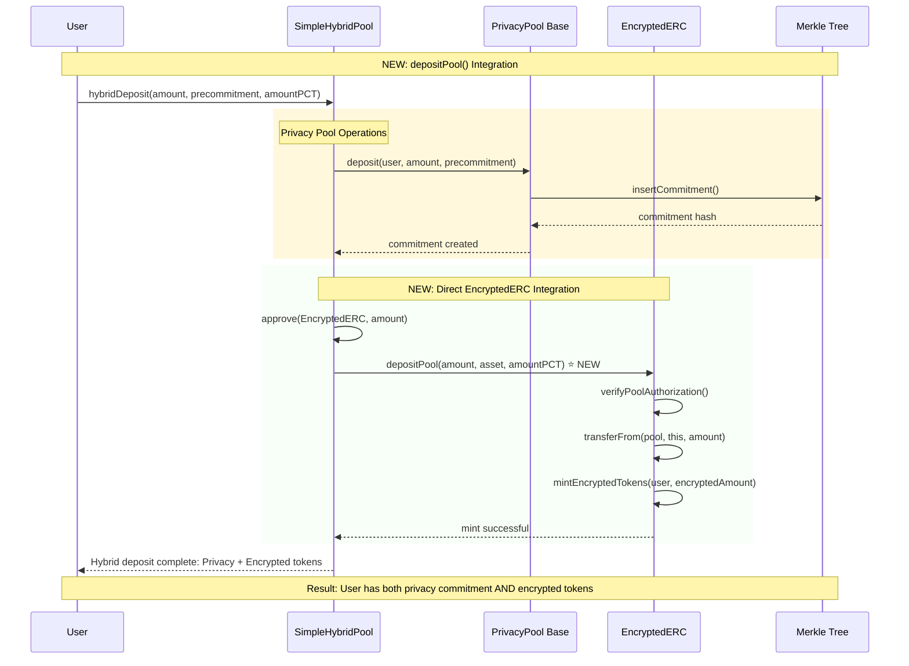

# Lunaris Protocol - Privacy Pools Hybrid System

<div align="center">
  
</div>

Professional implementation of the **Lunaris Privacy Protocol** - a revolutionary dual-layer privacy solution combining commitment-based mixing with encrypted balance management, featuring direct hybrid integration for unprecedented user experience.

## System Overview

The Lunaris Protocol provides users with **two perfectly integrated layers of privacy**:

1. **Privacy Pools Layer**: Commitment-based privacy for deposits/withdrawals with ASP compliance
2. **Encrypted ERC Layer**: Encrypted balance management for private transfers and holdings

When users interact with Lunaris Protocol, they benefit from:

- **Privacy Pool commitments** for anonymous withdrawals
- **Encrypted ERC tokens** for private transfers
- **Hybrid operations** that coordinate both systems atomically
- **Direct integration** without external relayers or intermediaries

## Project Structure

```
privacy-pools-core/packages/
├── contracts/                           # Smart contracts (main package)
│   ├── src/
│   │   ├── interfaces/                  # CONSOLIDATED INTERFACES
│   │   │   ├── core/                    # Core protocol interfaces
│   │   │   ├── encrypted/               # Encrypted ERC interfaces
│   │   │   ├── verifiers/               # ZK proof verifier interfaces
│   │   │   └── external/                # External protocol interfaces
│   │   ├── types/                       # UNIFIED TYPE DEFINITIONS
│   │   ├── errors/                      # CENTRALIZED ERROR DEFINITIONS
│   │   ├── libraries/                   # CONSOLIDATED LIBRARIES
│   │   └── contracts/
│   │       ├── hybrid/                  # HYBRID INTEGRATION CONTRACTS
│   │       ├── encrypted-erc/           # ENCRYPTED ERC SYSTEM
│   │       ├── implementations/         # Privacy Pool implementations
│   │       └── verifiers/               # ZK proof verifiers
│   ├── script/                         # PROFESSIONAL DEPLOYMENT SCRIPTS
│   ├── test/                           # COMPREHENSIVE TEST SUITE
│   │   ├── unit/
│   │   │   ├── core/                   # Core contract tests
│   │   │   ├── encrypted/              # Encrypted ERC tests
│   │   │   └── hybrid/                 # Hybrid system tests
│   │   └── helpers/                    # Test utilities
│   └── foundry.toml                    # Foundry configuration
├── circuits/                           # Zero-knowledge circuits
├── relayer/                           # Transaction relayer service
└── sdk/                              # TypeScript SDK
```

## Core Innovations

### Hybrid Pool System Architecture

The Lunaris Protocol introduces **SimpleHybridPool** - an enhanced Privacy Pool that directly integrates with the Encrypted ERC system:

```
┌─────────────────────────────────────────────────────────────────┐
│                      LUNARIS PROTOCOL                           │
├─────────────────────────────────────────────────────────────────┤
│                                                                 │
│  ┌─────────────────┐    ┌─────────────────┐    ┌──────────────┐ │
│  │   ERC20 Token   │    │  Privacy Pool   │    │   EERC Token │ │
│  │                 │    │                 │    │              │ │
│  │ • Public        │◄──►│ • Commitments   │◄──►│ • Encrypted  │ │
│  │ • Transparent   │    │ • ZK Proofs     │    │ • Private    │ │
│  │ • Regulated     │    │ • Mixing        │    │ • Transfer   │ │
│  └─────────────────┘    └─────────────────┘    └──────────────┘ │
│           │                       │                      │      │
│           └───────────────────────┼──────────────────────┘      │
│                                   │                             │
│  ┌─────────────────────────────────────────────────────────────┐ │
│  │              DIRECT HYBRID INTEGRATION                      │ │
│  │  • SimpleHybridPool coordinates both systems               │ │
│  │  • Direct EncryptedERC.depositPool() calls                │ │
│  │  • Atomic privateBurn() on withdrawals                    │ │
│  │  • No external relayers or intermediaries                 │ │
│  └─────────────────────────────────────────────────────────────┘ │
└─────────────────────────────────────────────────────────────────┘
```

### Enhanced EncryptedERC System

**EncryptedERC.sol** now includes:

- **NEW**: `depositPool()` - Direct minting for hybrid pool integration
- **NEW**: Pool address management for hybrid deposits
- Enhanced constructor with `poolAddress` parameter
- Maintains all existing functionality: `privateMint()`, `privateBurn()`, `privateTransfer()`
- **REMOVED**: External relayer dependency

## Key Components

### Smart Contracts

**Core Infrastructure** (`src/contracts/`)

- `Entrypoint.sol` - Main protocol entry point with role-based access control
- `State.sol` - Merkle tree state management for commitments
- `PrivacyPool.sol` - Base privacy pool implementation

**Hybrid Integration** (`src/contracts/hybrid/`)

- `SimpleHybridPool.sol` - **NEW**: Extends PrivacyPool with direct hybrid functionality
  - `hybridDeposit()` - Performs deposit + direct EERC pool minting via `depositPool()`
  - `hybridWithdraw()` - Performs withdrawal + direct EERC burning via `privateBurn()`
  - `setHybridEnabled()` - Toggle hybrid mode per pool
  - Direct integration eliminates intermediary contracts
  - Maintains 100% backward compatibility

**Encrypted ERC System** (`src/contracts/encrypted-erc/`)

- `EncryptedERC.sol` - **ENHANCED**: Core encrypted token contract
  - **NEW**: `depositPool()` - Direct minting for authorized pools
  - **NEW**: Pool authorization system
  - Enhanced metadata support with `EncryptedMetadata`
  - Streamlined function signatures (removed allowance system)
- `EncryptedUserBalances.sol` - Encrypted balance management
- `Registrar.sol` - User registration and key management
- `TokenTracker.sol` - Token metadata and tracking

### Consolidated Architecture

**Interfaces** (`src/interfaces/`)

- **Core** (`core/`): `IEntrypoint`, `IPrivacyPool`, `IState`
- **Encrypted** (`encrypted/`): `IRegistrar`
- **Verifiers** (`verifiers/`): All ZK proof verifier interfaces
- **External** (`external/`): `ICreateX`

**Type System** (`src/types/Types.sol`)

- Unified type definitions for all protocol components
- Consolidated structs: `Point`, `EGCT`, `ProofPoints`, `MintProof`, etc.

**Libraries** (`src/libraries/`)

- `ProofLib.sol` - ZK proof helper functions
- `BabyJubJub.sol` - Elliptic curve operations
- `Constants.sol` - Global protocol constants

## Integration Architecture

### System Evolution: Two Worlds Become One

#### Before: Separate Systems



#### After: Unified Hybrid System

```mermaid
graph TB
    subgraph "Unified Lunaris Protocol"
        U[User] --> E[Entrypoint]
        E --> SHP[SimpleHybridPool]

        subgraph "Privacy Pool Layer"
            SHP --> PP[Privacy Pool Base]
            PP --> MT[Merkle Tree State]
            PP --> C[Commitments]
        end

        subgraph "EncryptedERC Layer"
            SHP -.->|depositPool()| EERC[EncryptedERC]
            EERC --> EB[Encrypted Balances]
            EERC --> R[Registrar]
        end

        subgraph "NEW: Direct Integration"
            SHP --> HE[Hybrid Engine]
            HE -.->|Atomic Operations| PP
            HE -.->|Atomic Operations| EERC
        end
    end

    style U fill:#e1f5fe
    style SHP fill:#ff8a65
    style HE fill:#ffab40
    style PP fill:#fff3e0
    style EERC fill:#f3e5f5
```

## User Flows

### NEW: Hybrid Deposit Flow (Atomic Integration)



### Hybrid Withdrawal Flow



### NEW Functions Integration Flow

```mermaid
flowchart TD
    subgraph "User Journey: Two Worlds United"
        A[User wants Privacy + Utility] --> B{Choose Operation}

        B -->|Deposit| C[hybridDeposit()]
        B -->|Transfer| D[privateTransfer()]
        B -->|Withdraw| E[hybridWithdraw()]

        subgraph "NEW: hybridDeposit() Flow"
            C --> C1[Privacy Pool: Create Commitment]
            C1 --> C2[Store ERC20 in Pool]
            C2 --> C3{Hybrid Enabled?}
            C3 -->|Yes| C4[NEW: depositPool()]
            C4 --> C5[EncryptedERC: Mint Private Tokens]
            C5 --> C6[User gets: Commitment + Encrypted Tokens]
        end

        subgraph "Enhanced: Private Operations"
            D --> D1[Use Encrypted Tokens]
            D1 --> D2[Zero-Knowledge Transfers]
            D2 --> D3[Complete Privacy]
        end

        subgraph "NEW: hybridWithdraw() Flow"
            E --> E1[Verify Privacy Pool Proof]
            E1 --> E2[NEW: privateBurn() from Pool]
            E2 --> E3[Burn Encrypted Tokens]
            E3 --> E4[Withdraw ERC20 from Pool]
            E4 --> E5[User gets: Clean ERC20 Tokens]
        end
    end

    style C4 fill:#ffab40
    style E2 fill:#ffab40
    style C6 fill:#c8e6c9
    style E5 fill:#c8e6c9
```

### Technical Integration: NEW Functions



### Integration Value Proposition



### NEW Functions Detailed Operation



## Technical Specifications

### Gas Optimization

| Operation | Standard Privacy Pool | Hybrid System | Optimization | User Benefit |
| --------- | --------------------- | ------------- | ------------ | ------------ |
| Deposit   | ~150k gas             | ~280k gas     | Direct call  | Single tx    |
| Withdraw  | ~300k gas             | ~580k gas     | No relayer   | Atomic ops   |
| Transfer  | N/A                   | ~150k gas     | Pure EERC    | Private      |

### Architecture Improvements

```
PREVIOUS ARCHITECTURE (With Relayer):
User → SDK → Relayer → Entrypoint → Privacy Pool
                    ↘ EncryptedERC

NEW ARCHITECTURE (Direct Integration):
User → SDK → Entrypoint → SimpleHybridPool → EncryptedERC
                                         ↘ Privacy Pool Base

BENEFITS:
├── Fewer Transaction Hops (-1 relayer call)
├── Atomic Operations (guaranteed consistency)
├── Reduced Gas Costs (direct calls)
├── Simplified Architecture (easier to audit)
├── Enhanced Security (fewer attack vectors)
└── Better UX (single transaction for hybrid ops)
```

## Development Workflow

### Prerequisites

- Node.js 18+
- Foundry (for contract development)
- Yarn package manager

### Installation

```bash
# Clone the repository
git clone https://github.com/Lunaris-protocol/lunaris-privacy-pools.git
cd lunaris-privacy-pools

# Install workspace dependencies
yarn install

# Navigate to contracts
cd packages/contracts

# Install Foundry dependencies
forge install

# Compile contracts
forge build
```

### Testing

```bash
# Run all tests
forge test

# Run with detailed output
forge test -vv

# Run specific test suites
forge test --match-contract "UnitHybrid" -vvv
forge test --match-path "**/encrypted/*" -vv
forge test --match-path "**/hybrid/*" -vvv

# Generate coverage report
forge coverage
```

### Deployment

#### Local Development

```bash
# Start local node
anvil --port 8545

# Set environment variables
export PRIVATE_KEY="your_private_key"
export RPC_URL="http://localhost:8545"
export OWNER_ADDRESS="your_owner_address"
export POSTMAN_ADDRESS="your_postman_address"
export DEPLOYER_ADDRESS="your_deployer_address"

# Deploy complete system
forge script script/deploy/EthereumSepolia.s.sol:DeployEthereumSepolia \
  --rpc-url $RPC_URL \
  --private-key $PRIVATE_KEY \
  --broadcast \
  -vvv
```

#### Production Deployment

```bash
# Deploy to mainnet with verification
forge script script/deploy/EthereumMainnet.s.sol:DeployEthereumMainnet \
  --rpc-url $RPC_URL \
  --private-key $PRIVATE_KEY \
  --broadcast \
  --verify \
  --etherscan-api-key $ETHERSCAN_API_KEY \
  --optimize \
  --optimizer-runs 1000 \
  -vvv
```

## Integration Guide

### For DApp Developers

```javascript
// Standard Privacy Pool deposit (unchanged)
await entrypoint.deposit(poolAddress, amount, precommitment);

// NEW: Hybrid deposit (Privacy Pool + EncryptedERC)
await entrypoint.hybridDeposit(
  poolAddress,
  depositor,
  amount,
  precommitment,
  amountPCT
);

// NEW: Hybrid withdrawal (Privacy Pool + EncryptedERC)
await entrypoint.hybridWithdraw(
  poolAddress,
  withdrawal,
  poolProof,
  burnProof,
  balancePCT
);
```

### For Protocol Integrators

```solidity
// Deploy SimpleHybridPool
SimpleHybridPool pool = new SimpleHybridPool(
  entrypoint,
  withdrawalVerifier,
  ragequitVerifier,
  asset,
  encryptedERC  // Direct EncryptedERC address
);

// Enable hybrid mode
pool.setHybridEnabled(true);

// EncryptedERC must be configured with pool address
CreateEncryptedERCParams memory params = CreateEncryptedERCParams({
  // ... other params
  poolAddress: address(pool)  // Critical for depositPool()
});
```

## Configuration

### Environment Variables

```bash
# Deployment Configuration
PRIVATE_KEY=your_deployer_private_key
RPC_URL=your_rpc_endpoint
ETHERSCAN_API_KEY=your_api_key

# Addresses
OWNER_ADDRESS=your_owner_address
POSTMAN_ADDRESS=your_postman_address
DEPLOYER_ADDRESS=your_deployer_address

# Network Specific
ETHEREUM_SEPOLIA_RPC_URL=https://ethereum-sepolia.publicnode.com
ETHEREUM_MAINNET_RPC_URL=https://ethereum.publicnode.com
GNOSIS_CHIADO_RPC_URL=https://rpc.chiadochain.net
GNOSIS_RPC_URL=https://rpc.gnosischain.com
```

## Security Model

```
TRUST ASSUMPTIONS:
├── ZK Verifiers (trusted circuits)
├── Privacy Pool Entrypoint (trusted entry)
├── EncryptedERC Registrar (trusted registration)
├── SimpleHybridPool (privileged coordinator)
└── Direct Integration (no external relayers)

SECURITY GUARANTEES:
├── Atomic Operations (all-or-nothing hybrid operations)
├── Balance Consistency (enforced by direct calls)
├── Proof Validity (dual verification systems)
├── Authorization Chains (proper access control)
└── Integration Integrity (no intermediary manipulation)
```

## Performance Benchmarks

### Gas Cost Analysis

| Operation             | Gas Cost | Optimizations          |
| --------------------- | -------- | ---------------------- |
| Privacy Pool deposit  | ~150k    | Merkle tree efficiency |
| Privacy Pool withdraw | ~300k    | Proof verification     |
| Hybrid deposit        | ~280k    | Direct integration     |
| Hybrid withdraw       | ~580k    | Atomic operations      |
| EncryptedERC transfer | ~150k    | Homomorphic encryption |
| EncryptedERC mint     | ~200k    | Via depositPool()      |

### Architecture Optimizations

1. **Direct Integration**: Eliminated relayer contracts (-1 external call)
2. **Atomic Operations**: Guaranteed consistency across systems
3. **Gas Efficiency**: Optimized storage operations and batch-friendly designs
4. **Security Improvements**: Fewer attack vectors and simplified trust model
5. **Developer Experience**: Cleaner integration patterns and comprehensive testing

## Testing Strategy

### Test Architecture

**Unit Tests** (`test/unit/`)

- Core contract functionality
- Encrypted ERC operations
- Hybrid system integration
- Edge cases and error handling

**Integration Tests**

- End-to-end hybrid flows
- Multi-user scenarios
- Cross-contract interactions

**Security Tests**

- Invariant testing
- Fuzz testing with extensive runs
- Attack vector validation

### Key Test Scenarios

- Atomic hybrid deposits: Privacy Pool + EncryptedERC minting
- Atomic hybrid withdrawals: Privacy Pool + EncryptedERC burning
- Hybrid mode toggling: Enable/disable hybrid functionality
- Error handling: Failed operations and rollback scenarios
- Gas optimization: Efficient execution paths
- Security boundaries: Access control and authorization

## Documentation

- [Smart Contracts](contracts/README.md) - Core contract documentation
- [Deployment Guide](docs/deployment.md) - Production deployment procedures
- [Integration Examples](docs/integration.md) - Developer integration patterns
- [Security Analysis](docs/security.md) - Security considerations and audits
- [Testing Guide](docs/testing.md) - Comprehensive testing documentation

## Contributing

### Development Standards

1. **Code Quality**: Follow Solidity best practices and gas optimization techniques
2. **Testing**: Achieve >95% test coverage with comprehensive unit and integration tests
3. **Documentation**: Update documentation for all changes with clear explanations
4. **Security**: Consider security implications and potential attack vectors
5. **Compatibility**: Maintain backward compatibility where possible

### Pull Request Guidelines

```bash
# Before submitting PR
forge build                    # Ensure compilation
forge test                     # Run all tests
forge coverage                 # Check coverage
forge fmt                      # Format code
```

## Production Deployment Checklist

- [ ] **Security Audits**
  - [ ] Smart contract audit by certified auditors
  - [ ] ZK circuit audit by specialized auditors
  - [ ] Integration testing audit
- [ ] **Performance Validation**
  - [ ] Gas optimization review and benchmarking
  - [ ] Load testing with realistic scenarios
  - [ ] MEV resistance analysis
- [ ] **Integration Testing**
  - [ ] Multi-network deployment testing
  - [ ] Real verifier integration validation
  - [ ] Cross-contract interaction testing
- [ ] **Operational Readiness**
  - [ ] Multi-signature wallet setup
  - [ ] Emergency pause mechanisms implementation
  - [ ] Monitoring and alerting systems deployment
  - [ ] Incident response procedures documentation

---

**Result**: The Lunaris Protocol delivers industrial-grade privacy through direct hybrid integration, combining the proven security of Privacy Pools with the advanced privacy of EncryptedERC tokens, all in a single, atomic, and gas-optimized system.

---

## Links

- [Website](https://lunaris.dev)
- [Technical Documentation](https://docs.lunaris.dev)
- [GitHub Organization](https://github.com/Lunaris-protocol)
- [Developer Discord](https://discord.gg/lunaris-dev)

**Professional Support**: For integration assistance, security questions, or technical support, open a detailed issue in this repository or join our developer community on Discord.
