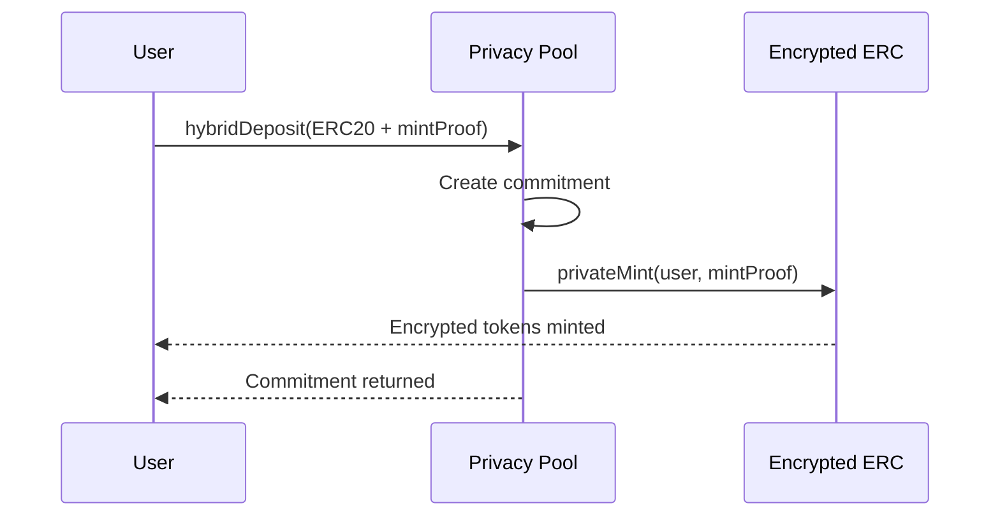
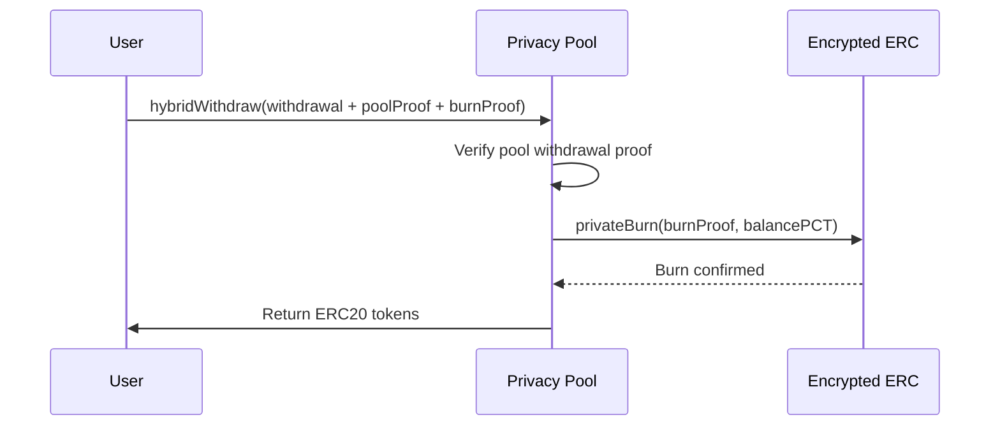

# Hybrid Privacy Pool + EncryptedERC System

## 🎯 Overview

This directory contains the **Hybrid Integration** between Privacy Pools and EncryptedERC tokens. The system provides users with **dual-layer privacy** by combining commitment-based privacy (Privacy Pools) with encrypted balance privacy (EncryptedERC).

## 🏗️ Architecture

### Core Components

```
┌─────────────────────────────────────────────────────────────────┐
│                    HYBRID SYSTEM ARCHITECTURE                   │
├─────────────────────────────────────────────────────────────────┤
│                                                                 │
│  ┌─────────────────┐    ┌─────────────────┐    ┌──────────────┐ │
│  │   ERC20 Token   │    │  Privacy Pool   │    │   EERC Token │ │
│  │                 │    │                 │    │              │ │
│  │ • Public        │◄──►│ • Commitments   │◄──►│ • Encrypted  │ │
│  │ • Transparent   │    │ • ZK Proofs     │    │ • Private    │ │
│  │ • Regulated     │    │ • Mixing        │    │ • Transfer   │ │
│  └─────────────────┘    └─────────────────┘    └──────────────┘ │
│           │                       │                      │      │
│           └───────────────────────┼──────────────────────┘      │
│                                   │                             │
│  ┌─────────────────────────────────────────────────────────────┐ │
│  │              SIMPLE HYBRID POOL                            │ │
│  │  • Coordinates both systems                                 │ │
│  │  • Ensures atomic operations                               │ │
│  │  • Manages hybrid mode toggle                              │ │
│  └─────────────────────────────────────────────────────────────┘ │
└─────────────────────────────────────────────────────────────────┘
```

### Key Features

- **🔄 Automatic Minting**: When users deposit ERC20 tokens, EncryptedERC tokens are automatically minted
- **🔥 Automatic Burning**: When users withdraw from the Privacy Pool, their EncryptedERC tokens are automatically burned
- **⚙️ Backward Compatibility**: Existing Privacy Pool functionality remains intact
- **🎛️ Configurable**: Hybrid mode can be enabled/disabled per pool
- **🔒 Atomic Operations**: All operations are atomic - either both succeed or both fail

## 📋 Contract Details

### SimpleHybridPool

```solidity
contract SimpleHybridPool is PrivacyPool {
    IEncryptedERC public encryptedERC;
    bool public hybridEnabled;

    // Core hybrid functions
    function hybridDeposit(address _depositor, uint256 _value, uint256 _precommitmentHash, MintProof calldata _mintProof) external returns (uint256);
    function hybridWithdraw(Withdrawal memory _withdrawal, ProofLib.WithdrawProof memory _poolProof, BurnProof calldata _burnProof, uint256[7] calldata _balancePCT) external;

    // Configuration
    function setHybridEnabled(bool _enabled) external;
}
```

#### Key Functions

- **`hybridDeposit()`**: Performs a Privacy Pool deposit and automatically mints EncryptedERC tokens
- **`hybridWithdraw()`**: Performs a Privacy Pool withdrawal and automatically burns EncryptedERC tokens
- **`setHybridEnabled()`**: Enables/disables the hybrid functionality

## 🔄 Usage Flow

### 1. Deposit Flow



**Step-by-step process:**

1. User calls `hybridDeposit()` with ERC20 tokens and mint proof
2. Privacy Pool creates commitment and stores tokens
3. EncryptedERC tokens are automatically minted to the user
4. User receives both Privacy Pool commitment and EncryptedERC tokens

### 2. Withdrawal Flow



**Step-by-step process:**

1. User calls `hybridWithdraw()` with withdrawal proof and burn proof
2. Privacy Pool validates the withdrawal proof
3. EncryptedERC tokens are automatically burned
4. Privacy Pool processes withdrawal and returns ERC20 tokens
5. User receives ERC20 tokens and Privacy Pool commitment

## 🎨 Privacy Benefits

### Dual Privacy Protection

| Privacy Aspect              | Standard ERC20 | Privacy Pool Only | EERC Only  | **Hybrid (Our Solution)** |
| --------------------------- | -------------- | ----------------- | ---------- | ------------------------- |
| **Transfer Privacy**        | ❌ Public      | ❌ Public         | ✅ Private | ✅ **Private**            |
| **Balance Privacy**         | ❌ Public      | ❌ Public         | ✅ Private | ✅ **Private**            |
| **Deposit/Withdrawal Link** | ❌ Public      | ✅ Private        | ❌ Public  | ✅ **Private**            |
| **Regulatory Compliance**   | ✅ Yes         | ✅ Yes            | ❌ No      | ✅ **Yes**                |

### Privacy Comparison

```
Standard ERC20:
┌─────────────────────────────────────────────────────────┐
│ Public: Amount, Sender, Receiver, Timestamp            │
│ Private: Nothing                                        │
└─────────────────────────────────────────────────────────┘

Privacy Pool Only:
┌─────────────────────────────────────────────────────────┐
│ Public: Deposit/Withdrawal amounts, timestamps         │
│ Private: Connection between deposits and withdrawals   │
└─────────────────────────────────────────────────────────┘

Encrypted ERC Only:
┌─────────────────────────────────────────────────────────┐
│ Public: Nothing                                         │
│ Private: Everything (amounts, transfers, balances)     │
└─────────────────────────────────────────────────────────┘

HYBRID (Our Solution):
┌─────────────────────────────────────────────────────────┐
│ Public: Only deposit/withdrawal events                 │
│ Private: All transfers, balances, connections          │
│ Compliance: Approved address sets for withdrawals      │
└─────────────────────────────────────────────────────────┘
```

## ⚡ Gas Costs & Performance

| Operation | Standard Privacy Pool | Hybrid System | Additional Cost |
| --------- | --------------------- | ------------- | --------------- |
| Deposit   | ~150k gas             | ~350k gas     | +200k (+133%)   |
| Withdraw  | ~300k gas             | ~700k gas     | +400k (+133%)   |
| Transfer  | N/A                   | ~150k gas     | New capability  |

**Cost Breakdown:**

- Privacy Pool operations: ~150k-300k gas
- EncryptedERC minting/burning: ~150k gas
- Additional coordination: ~50k gas
- Storage operations: ~50k gas

## 🛡️ Security Model

### Trust Assumptions

1. **ZK Verifiers**: Trusted circuits for proof validation
2. **Privacy Pool Entrypoint**: Trusted entry point (unchanged)
3. **EncryptedERC Registrar**: Trusted user registration (unchanged)
4. **Hybrid Pool Contract**: Trusted coordinator with privileged access

### Security Guarantees

1. **Balance Consistency**: EncryptedERC balances match pool commitments
2. **Atomic Operations**: Withdrawals are atomic - burn must succeed for withdrawal
3. **Proof Validity**: All ZK proofs must be valid for operations to proceed
4. **Authorization**: Only authorized entrypoint can call hybrid functions

### Attack Vectors & Mitigations

| Attack Vector               | Mitigation                                  |
| --------------------------- | ------------------------------------------- |
| **Invalid Proofs**          | Dual verification, circuit audits           |
| **State Desynchronization** | Atomic operations, comprehensive validation |
| **Gas Griefing**            | Gas limits, efficient implementations       |
| **Reentrancy**              | Reentrancy guards, proper state management  |

## 🧪 Testing

The system includes comprehensive tests that verify:

- ✅ Proper initialization and configuration
- ✅ Deposit flow with automatic EncryptedERC minting
- ✅ Withdrawal flow with automatic EncryptedERC burning
- ✅ Hybrid mode enable/disable functionality
- ✅ Error handling for failed operations
- ✅ Security edge cases and attack prevention
- ✅ Gas optimization verification
- ✅ Backward compatibility validation

### Running Tests

```bash
# Run all hybrid tests
forge test --match-contract HybridTest -vvv

# Run specific test
forge test --match-test testHybridDeposit -vvv

# Run with coverage
forge coverage --match-contract HybridTest
```

### Key Test Scenarios

- **End-to-end deposit with encrypted minting**
- **End-to-end withdrawal with coordinated burning**
- **Multi-user scenarios with different assets**
- **Security edge cases and attack prevention**
- **Gas optimization verification**
- **Backward compatibility validation**

## 🔧 Configuration

### Required Contracts (must be deployed first)

- Privacy Pools Entrypoint
- Privacy Pool verifiers (withdrawal, ragequit)
- EncryptedERC components (registrar, verifiers)
- ERC20 tokens to support

### System Parameters

- Minimum deposit amounts per asset
- Fee structures (vetting fees, relay fees)
- Tree depth limits
- Gas limits

### Environment Variables

```bash
# Deployment
PRIVATE_KEY=your_deployer_private_key
RPC_URL=your_rpc_endpoint
ETHERSCAN_API_KEY=your_api_key

# Network specific
FUJI_RPC_URL=https://api.avax-test.network/ext/bc/C/rpc
AVALANCHE_RPC_URL=https://api.avax.network/ext/bc/C/rpc
```

## 🚀 Integration

This hybrid system integrates seamlessly with existing Privacy Pool infrastructure while adding EncryptedERC functionality. The system maintains all existing Privacy Pool features while adding the new hybrid capabilities.

### Integration Points

1. **Privacy Pool**: Extended with hybrid functionality
2. **EncryptedERC**: Extended with orchestrator privileges
3. **Entrypoint**: Coordinates both systems
4. **SDK**: Updated to support hybrid operations

## 📈 Roadmap

### Phase 1: Core Implementation ✅

- [x] Hybrid contracts development
- [x] Integration architecture
- [x] Basic testing suite

### Phase 2: Testing & Security 🔄

- [ ] Comprehensive security audit
- [ ] Gas optimization
- [ ] Edge case testing
- [ ] Performance benchmarking

### Phase 3: Production Ready 📋

- [ ] Mainnet deployment
- [ ] Multi-signature setup
- [ ] Monitoring integration
- [ ] Documentation finalization

### Phase 4: Advanced Features 🚀

- [ ] Multi-chain support
- [ ] SDK integration
- [ ] UI/UX improvements
- [ ] Governance mechanisms

## 🔗 Related Projects

- **[Privacy Pools Protocol](https://github.com/0xPARC/privacy-pools)** - Base protocol
- **[Encrypted ERC](https://github.com/ava-labs/encrypted-erc)** - Encrypted balance tokens
- **[Circom](https://github.com/iden3/circom)** - Circuit development framework
- **[Foundry](https://github.com/foundry-rs/foundry)** - Development toolkit

## 📄 License

This project is licensed under the Apache 2.0 License. See the LICENSE file for details.

---

**🎯 Mission**: Providing users with the strongest possible privacy through dual-layer protection while maintaining seamless user experience and backward compatibility.
